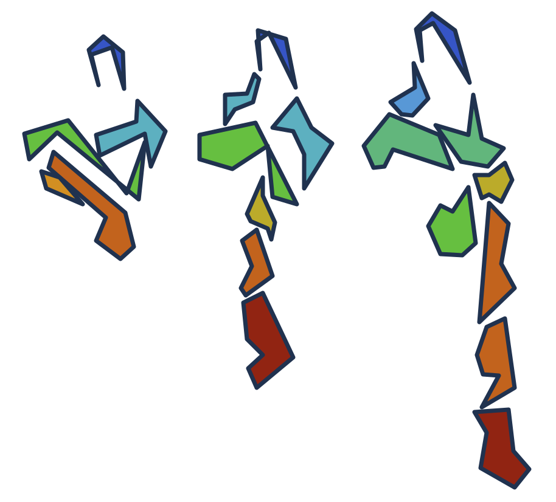

Flipbook trajectory analysis
============================

RMSX partitions a molecular dynamics trajectory into time slices and computes
per-residue RMSF within each slice. This Galaxy wrapper exposes the RMSX compute
path and returns workflow-friendly Galaxy datasets: RMSX, RMSD, and RMSF CSV
tables; mask metadata; a list collection of PDB slice snapshots; a standalone
RMSX heatmap PNG; the original RMSD/RMSX/RMSF triple plot PNG; an execution log;
and a schema-validated JSON manifest for the native Galaxy Molstar Flipbook
viewer.

Scope
-----

The Tool Shed candidate is a Flipbook Galaxy wrapper backed by RMSX. The tool
performs the analysis and emits a typed viewer manifest; Galaxy launches the
native Molstar visualization from that output through its Visualize action.
The wrapper does not require ChimeraX, VMD, an external viewer server, or a
trusted HTML report.

The first reviewable wrapper path accepts PDB topology/structure input and DCD
or XTC trajectory input. RMSX and MDAnalysis can support additional molecular
dynamics formats, but broader Galaxy datatype coverage should be added
deliberately with tests for each supported pair.

Viewer manifest
---------------

The Molstar Flipbook manifest uses schema version
``flipbook-molstar-viewer/v1`` and is emitted as typed Galaxy ``rmsx.json``.
That datatype makes the manifest a first-class visualization-ready output
instead of arbitrary JSON. The datatype and native visualization registration
are proposed upstream in ``galaxyproject/galaxy#23009``; the packaged viewer is
proposed in ``galaxyproject/galaxy-visualizations#174``.

Dependency status
-----------------

The wrapper currently declares RMSX, MDAnalysis, Python table dependencies,
Plotly, the rich-display package imported by upstream RMSX at startup,
``r-base``, and the R plotting packages required by the original RMSX plot
script. A temporary container scaffold is provided at
``ghcr.io/antuneslab/flipbook-galaxy:0.2.3-galaxy0`` and pins upstream RMSX
``v0.2.3``. That tag currently installs Python package metadata as
``rmsx==0.1.0``, so the wrapper requirement and version command remain honest
about the executable package version while this upstream metadata mismatch is
tracked as an upstream packaging issue. The intended durable route is a
Conda/Bioconda RMSX package and a Galaxy-visible mulled container generated
from Conda dependencies.

The Galaxy runtime path must not install R packages at job runtime. The
container and future Conda recipe should preinstall the R stack and tests should
exercise plotting without network access.

Publication notes
-----------------

* The bundled XTC fixture preserves all 316 frames from the original demo
  trajectory while staying below the community repository's 1 MB file-size
  check. Its
  source, redistribution terms, checksums, and regeneration command are
  recorded in ``test-data/README.md`` and ``test-data/LICENSE.md``. Repository
  maintainers should confirm that the educational-use terms are acceptable for
  bundled test data.
* ``galaxyproject/galaxy#23009`` must be merged before standard Galaxy installs
  recognize the ``rmsx.json`` output datatype.
* ``galaxyproject/galaxy-visualizations#174`` must be merged and version 0.0.2
  published before Galaxy can consume the final viewer package.
* The pinned GHCR runtime must be publicly and anonymously pullable before a
  community wrapper CI job can execute the tests.
* A bio.tools entry or equivalent EDAM/xref strategy should be settled before
  submission.
* Upstream RMSX release metadata should be reconciled so the tag, package
  version, and Galaxy wrapper version tell the same story.
* Test-data provenance and the full transitive dependency license inventory
  should be kept with the review packet.

License
-------

This wrapper repository is MIT licensed. The bundled trajectory fixture is
third-party educational material and is explicitly excluded from the MIT grant;
see ``test-data/LICENSE.md``. Upstream RMSX and Molstar are MIT licensed, and
MDAnalysis uses LGPL-compatible licensing. The final community review packet
should include transitive license checks for Conda, pip, R, and packaged
JavaScript assets.
